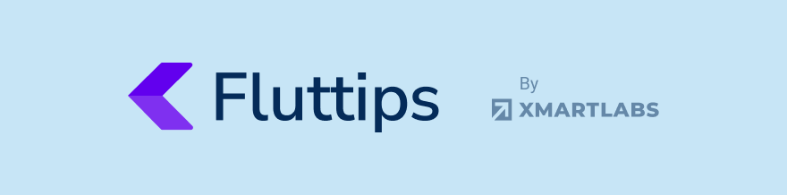

[](https://github.com/xmartlabs/fluttips/actions/workflows/flutter-ci.yml)

Fluttips is the first app that brings together all the best tips and tricks for programming in Flutter in one place.
It allows you to access this information easily and quickly, making it a valuable resource for developers.

Some of its features include images and code explanations, making it easy to understand the tips provided.
Additionally, users can save their favorite tips to a "favorites" section, allowing them to easily access them later.

In an upcoming version, you will be able to view "Widget of the Week" videos, which will provide you with detailed information about various elements of Flutter.


Made with ❤️ by [Xmartlabs][xmartlabs] and based on [our template][xmartlabs_template], which provides a clean architecture.

📸 The image tips are from [Vandadnp][Vandadnp]

🎥 The videos are from [Widgets of the week][Widget_of_the_week].

## Contribute

  👉 If you **want to contribute** please feel free to **submit pull requests**.

  👉 If you **have a feature request** please **[open an issue][new_issue]**.

  👉 If you **found a bug** or **[need help][new_issue]** please let us know.

  👉 If you enjoy using **Fluttips** we would love to hear about it! Drop us a line on [twitter][twitter].


## License 

```

Copyright (c) 2023 Xmartlabs SRL

Permission is hereby granted, free of charge, to any person obtaining a copy
of this software and associated documentation files (the "Software"), to deal
in the Software without restriction, including without limitation the rights
to use, copy, modify, merge, publish, distribute, sublicense, and/or sell
copies of the Software, and to permit persons to whom the Software is
furnished to do so, subject to the following conditions:

The above copyright notice and this permission notice shall be included in all
copies or substantial portions of the Software.

THE SOFTWARE IS PROVIDED "AS IS", WITHOUT WARRANTY OF ANY KIND, EXPRESS OR
IMPLIED, INCLUDING BUT NOT LIMITED TO THE WARRANTIES OF MERCHANTABILITY,
FITNESS FOR A PARTICULAR PURPOSE AND NONINFRINGEMENT. IN NO EVENT SHALL THE
AUTHORS OR COPYRIGHT HOLDERS BE LIABLE FOR ANY CLAIM, DAMAGES OR OTHER
LIABILITY, WHETHER IN AN ACTION OF CONTRACT, TORT OR OTHERWISE, ARISING FROM,
OUT OF OR IN CONNECTION WITH THE SOFTWARE OR THE USE OR OTHER DEALINGS IN THE
SOFTWARE.

```

[xmartlabs]: http://xmartlabs.com
[xmartlabs_template]: https://github.com/xmartlabs/flutter-template
[Vandadnp]: https://github.com/vandadnp/rust-tips-and-tricks
[Widget_of_the_week]: https://www.youtube.com/playlist?list=PLjxrf2q8roU23XGwz3Km7sQZFTdB996iG
[twitter]: https://twitter.com/xmartlabs
[new_issue]: https://github.com/xmartlabs/fluttips/issues/new