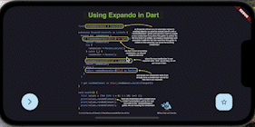
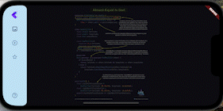

# Fluttips

## Introduction

Fluttips is the first application that provides tips for programming in Flutter.
It provides different sections, for example, you can see images with code explications and if you like, you can save the tip to see it later in favorites section.
In a coming soon version, you will see videos of the widgets of the week, that provides you information about different components of Flutter.

<table>
  <tr>
    <th>Images</th>
    <th></th>
  </tr>
  <tr>
    <th>Favorites</th>
    <th></th>
  </tr>
</table>

The application was made with love by [Xmartlabs][xmartlabs] team and Fluttips is based on [Xmartlabs template][xmartlabs_template], which provides a clean architecture.   
The images tips are from [Vandadnp][Vandadnp]
and the videos are from [Widgets of the week][Widget_of_the_week].

## Contribute

- If you **want to contribute** please feel free to **submit pull requests**.
- If you **have a feature request** please **open an issue**.
- If you **found a bug** or **need help** please let us know. 

[xmartlabs]: http://xmartlabs.com
[xmartlabs_template]: https://github.com/xmartlabs/flutter-template
[Vandadnp]: https://github.com/vandadnp/rust-tips-and-tricks
[Widget_of_the_week]: https://www.youtube.com/playlist?list=PLjxrf2q8roU23XGwz3Km7sQZFTdB996iG